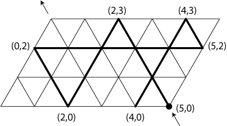
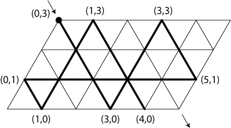

In the movie *Die Hard: With a Vengeance* John (Bruce Willis) and Zeus (Samuel Jackson) are having a little problem with jugs.

> 58:00  
SIMON (via a mobile phone): I trust you see the message. It (the bomb) has a proximity circuit. So please, don't run.  
JOHN: Yeah, I got it. We're not gonna run. How do we turn this thing off?  
SIMON: On the fountain, there should be 2 jugs, do you see them? A 5 gallon and a 3 gallon. Fill one of the jugs with exactly 4 gallons of water and place it on the scale and the timer will stop. You must be precise, one ounce more or less will result in detonation. If you're still alive in 5 minutes, we'll speak.  
JOHN: Wait, wait a second. I don't get it. Do you get it?  
ZEUS: No.  
JOHN: Get the jugs. Obviously, we can't fill the 3 gallon jug with 4 gallons of water.  
ZEUS: Obviously.  
JOHN: All right. I know, here we go. We fill the 3 gallon jug exactly to the top, right?  
ZEUS: Huhuhu.  
JOHN: Okay, now. We pour that 3 gallons into the 5 gallon jug. Given us exactly 3 gallons in the 5 gallon jug, right?  
ZEUS: Right, then what?  
JOHN: All right. We take the 3 gallon jug and fill it at the 3rd of the way...  
ZEUS: No, he said: Be precise. Exactly 4 gallons.  
JOHN: Shit. Every cop within 50 miles is running his ass off and I'm out here playing kids games in the park.  
.............  
1:00:02  
JOHN: Look, we can't take this off, it will detonate. Just wait, wait a second. I got it. I got it. Exactly 2 gallons in here, right?  
ZEUS: Right.  
JOHN: Leaving exactly 1 gallon of empty space, right?  
ZEUS: Yeah.  
JOHN: A full 5 gallon here, right?  
ZEUS: Right.  
JOHN: You pull 1 gallon out of 5 gallon in there, we have exactly 4 gallons in here.  
ZEUS: Yes.  
JOHN: Come on. Don't spill any. Good, good, good. Exactly 4 gallons.  
ZEUS: You did it McClane.  

### Billiards Solution of the Die Hard Problem

We use the special parallelogram-shaped billiards table shown in the following diagram.

The dimensions of the table are 5 by 3 units, the angle in the lower left corner is 60
degrees. We coordinatize the table in the natural way, such that the lower left corner
is the origin and the upper right corner is the point with coordinates `(5,3)`. We now
shoot a ball located at the lower right corner as indicated. As the ball travels across
the table, we note down the coordinates of the points on the upper and lower rail in
the order that the ball bounces off them. 

`(5,0)` `(2,3)` `(2,0)` `(0,2)` `(5,2)` `(4,3)` `(4,0)` etc.

This sequence of coordinates corresponds to a solution of our problem as follows:  
`(5,0)` = fill the 5-gallon jug  
`(2,3)` = fill the 3-gallon jug from the 5-gallon jug, leaving two gallons in the 5-gallon jug.  
`(2,0)` = empty the 3-gallon jug  
`(0,2)` = empty the two gallons in the 5-gallon jug into the 3-gallon jug.  
`(5,2)` = fill the 5-gallon jug etc.  
If we keep following the ball, we notice that it traverses every single one of the lines drawn on the table once each before it hits the upper left corner. In particular, this means that the path of the ball includes the following points with integer coordinates on the boundary of the table. In particular, it contains the points
 
`(1,0)`, `(2,0)`, `(3,0)`, `(4,0)`, `(5,0)` and  
`(0,3)`, `(1,3)`, `(2,3)`, `(3,3)`, `(4,3)`.

We conclude that even if Simon had asked John and Zeus to produce exactly `1, 2, 3, 4, 5, 6 (=3+3)`, `7 (=4+3)` gallons, the puzzle would have had a solution (in the cases 6 and 7 they would have to put both jugs on the scales). Of course, 0 and 8 are also possible.

#### The Other Solution

Hidden in the diagram is a second solution to our problem: just put the ball in the upper left corner, as in the following diagram, and shoot as indicated by the arrow. What we are doing here is traversing the path that we considered before in reverse. 

The new path corresponds to the solution  
`(0,3)` `(3,0)` `(3,3)` `(5,1)` `(0,1)` `(1,0)` `(1,3)` `(4,0)`

#### Half-Turn Symmetry

The complete path from the bottom right to the top left gives rise to the following
sequence:  
`(5,0)` `(2,3)` `(2,0)` `(0,2)` `(5,2)` `(4,3)` `(4,0)` `(1,3)` `(1,0)` `(0,1)` `(5,1)` `(3,3)` `(3,0)` `(0,3)`
As we have already pointed out, the second complete path is just this first one traversed in reverse, that is, it corresponds to the following sequence, which is just the reverse of the above sequence:  
`(0,3)` `(3,0)` `(3,3)` `(5,1)` `(0,1)` `(1,0)` `(1,3)` `(4,0)` `(4,3)` `(5,2)` `(0,2)` `(2,0)` `(2,3)` `(5,0)`
However, because of the half-turn symmetry of the table that turns the first path into the second path, you also get the second sequence by subtracting every element of the first sequence from `(5,3)`: `(5,3) – (5,0) = (0,3)`, `(5,3)– (2,3) = (3,0)`, `(5,3) – (2,0) = (3,3)`, etc.